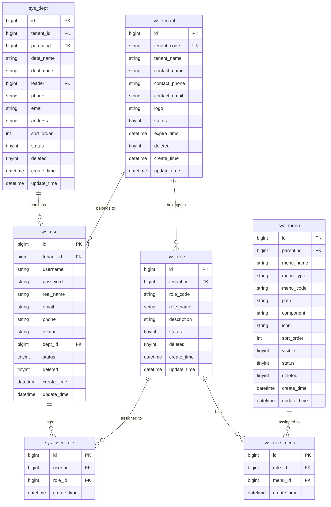
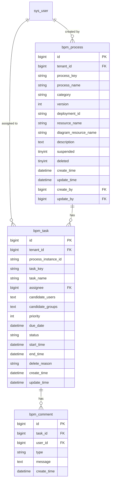
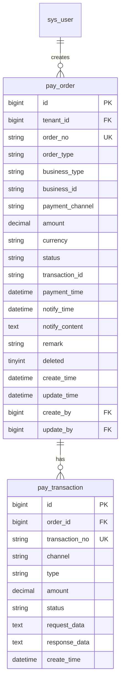
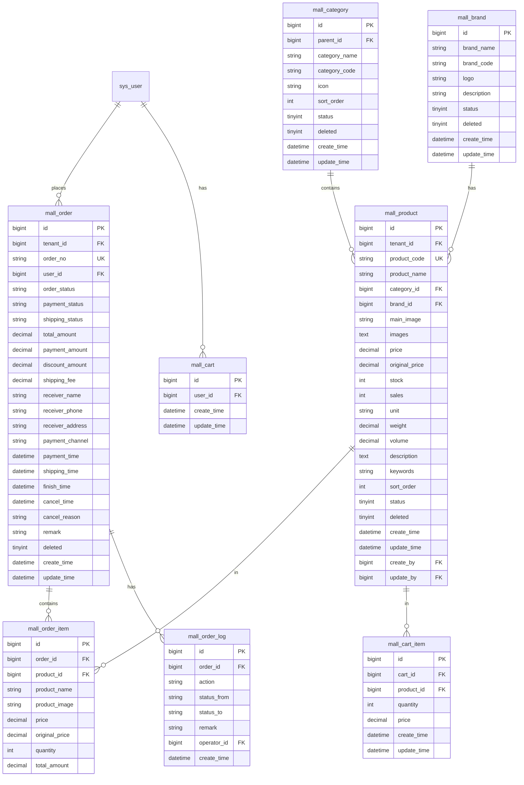
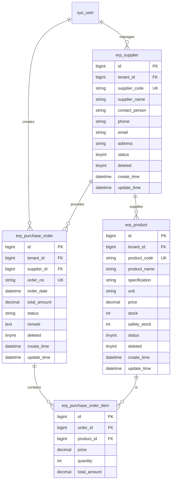

# ER Diagram

## Overview

This document describes the entity-relationship (ER) diagram for the UniEnterprise project database schema.

---

## ER Diagram (Mermaid)

### System Management

### Workflow Management

### Payment Management

### E-Commerce Management

### CRM Management

```mermaid
erDiagram
    sys_user ||--o{ crm_lead : "manages"
    sys_user ||--o{ crm_customer : "manages"
    sys_user ||--o{ crm_opportunity : "manages"
    crm_lead ||--|| crm_customer : "converts to"
    crm_customer ||--o{ crm_opportunity : "has"
    crm_opportunity ||--o{ crm_contract : "results in"
    sys_user ||--o{ crm_contract : "signs"
    crm_contract ||--o{ crm_payment : "has"

    crm_lead {
        bigint id PK
        bigint tenant_id FK
        bigint owner_id FK
        string lead_name
        string company_name
        string phone
        string email
        string source
        string status
        int score
        text remark
        tinyint deleted
        datetime create_time
        datetime update_time
    }

    crm_customer {
        bigint id PK
        bigint tenant_id FK
        bigint owner_id FK
        string customer_name
        string company_name
        string contact_person
        string phone
        string email
        string address
        string industry
        int level
        text remark
        tinyint deleted
        datetime create_time
        datetime update_time
    }

    crm_opportunity {
        bigint id PK
        bigint tenant_id FK
        bigint customer_id FK
        bigint owner_id FK
        string opportunity_name
        decimal expected_amount
        datetime expected_close_date
        string stage
        int probability
        text description
        tinyint deleted
        datetime create_time
        datetime update_time
    }

    crm_contract {
        bigint id PK
        bigint tenant_id FK
        bigint customer_id FK
        bigint owner_id FK
        bigint opportunity_id FK
        string contract_no UK
        string contract_name
        decimal amount
        datetime start_date
        datetime end_date
        string status
        string file_url
        text remark
        tinyint deleted
        datetime create_time
        datetime update_time
    }

    crm_payment {
        bigint id PK
        bigint tenant_id FK
        bigint contract_id FK
        string payment_no UK
        decimal amount
        datetime payment_date
        string payment_method
        string status
        text remark
        tinyint deleted
        datetime create_time
        datetime update_time
    }
```

### ERP Management

---

## Relationships Summary

### Primary Relationships

| From Table | To Table | Relationship | Description |
|-------------|-----------|--------------|-------------|
| sys_user | sys_user_role | One-to-Many | User can have multiple roles |
| sys_role | sys_user_role | One-to-Many | Role can be assigned to multiple users |
| sys_role | sys_role_menu | One-to-Many | Role can have multiple menus |
| sys_menu | sys_role_menu | One-to-Many | Menu can be assigned to multiple roles |
| sys_dept | sys_user | One-to-Many | Department can have multiple users |
| sys_tenant | sys_user | One-to-Many | Tenant can have multiple users |
| mall_order | mall_order_item | One-to-Many | Order can have multiple items |
| mall_product | mall_order_item | One-to-Many | Product can be in multiple order items |

### Foreign Key Constraints

| Table | Column | References | On Delete |
|-------|--------|------------|-----------|
| sys_user_role | user_id | sys_user(id) | CASCADE |
| sys_user_role | role_id | sys_role(id) | CASCADE |
| sys_user | dept_id | sys_dept(id) | SET NULL |
| sys_user | tenant_id | sys_tenant(id) | CASCADE |
| mall_order | user_id | sys_user(id) | CASCADE |
| mall_order_item | order_id | mall_order(id) | CASCADE |
| mall_order_item | product_id | mall_product(id) | CASCADE |

---

## Index Strategy

### Primary Keys

All tables have `id` as primary key (BIGINT, AUTO_INCREMENT)

### Unique Indexes

| Table | Columns |
|-------|----------|
| sys_user | (tenant_id, username) |
| sys_role | (tenant_id, role_code) |
| sys_tenant | tenant_code |
| pay_order | order_no |
| mall_order | order_no |
| mall_product | (tenant_id, product_code) |
| crm_contract | contract_no |
| erp_product | (tenant_id, product_code) |

### Regular Indexes

| Table | Columns |
|-------|----------|
| sys_user | tenant_id, dept_id, email, phone |
| sys_role | tenant_id |
| sys_menu | parent_id, menu_code |
| pay_order | tenant_id, (business_type, business_id) |
| mall_order | tenant_id, user_id, order_status |
| mall_product | tenant_id, category_id |

---

## Version History

| Version | Date | Author | Changes |
|---------|-------|---------|----------|
| 1.0.0 | 2025-01-11 | Initial ER diagram |
