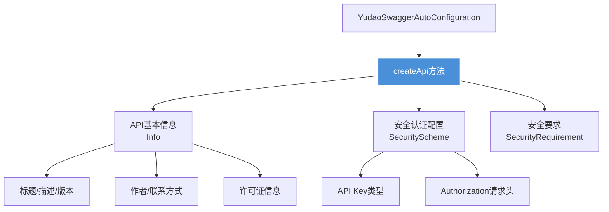

The user wants me to explain a code block from the file `YudaoSwaggerAutoConfiguration.java`, specifically lines 57-69. This is a method that creates an OpenAPI configuration for Swagger documentation.

Let me first read the entire file to get better context, then provide a comprehensive explanation.
Now I have the full context of the file. Let me explain the `createApi` method (lines 57-69) in detail, including its surrounding context and how it fits into the overall architecture.
## 代码解析：`createApi` 方法

这段代码是 **Swagger/OpenAPI 自动配置** 的核心方法，负责构建 API 文档的全局配置。让我从架构设计到实现细节为你详细解析：

---

### 📐 整体架构定位



---

### 🔍 逐行解析

```57:69:yudao-framework/yudao-spring-boot-starter-web/src/main/java/cn/iocoder/yudao/framework/swagger/config/YudaoSwaggerAutoConfiguration.java
@Bean
public OpenAPI createApi(SwaggerProperties properties) {
    Map<String, SecurityScheme> securitySchemas = buildSecuritySchemes();
    OpenAPI openAPI = new OpenAPI()
            // 接口信息
            .info(buildInfo(properties))
            // 接口安全配置
            .components(new Components().securitySchemes(securitySchemas))
            .addSecurityItem(new SecurityRequirement().addList(HttpHeaders.AUTHORIZATION));
    securitySchemas.keySet().forEach(key -> openAPI.addSecurityItem(new SecurityRequirement().addList(key)));
    return openAPI;
}
```

| 行号 | 代码 | 作用说明 |
|------|------|----------|
| 57 | `@Bean` | 将方法返回的 `OpenAPI` 对象注册为 Spring Bean，供 Springdoc 使用 |
| 58 | `SwaggerProperties` | 从 `application.yaml` 注入的 Swagger 配置属性（标题、版本等）|
| 59 | `buildSecuritySchemes()` | 构建安全方案：使用 **API Key** 认证，通过 `Authorization` 请求头传递 Token |
| 60-62 | `.info(...)` | 设置 API 文档的基本信息（标题、描述、版本、作者等）|
| 64 | `.components(...)` | 注册安全组件，定义认证方式 |
| 65-66 | `.addSecurityItem(...)` | **关键设计**：双重注册安全要求，确保所有接口默认需要认证 |
| 67 | `return openAPI` | 返回配置好的 OpenAPI 对象 |

---

### 🎯 核心设计亮点

#### 1. **双重安全要求注册（第65-66行）**

```java
.addSecurityItem(new SecurityRequirement().addList(HttpHeaders.AUTHORIZATION));
securitySchemas.keySet().forEach(key -> openAPI.addSecurityItem(new SecurityRequirement().addList(key)));
```

**为什么这样做？**

- **第65行**：显式添加 `Authorization` 安全要求，确保向后兼容
- **第66行**：遍历所有安全方案动态添加，支持未来扩展多种认证方式
- 这种设计使得 Swagger UI 会在每个接口上显示 🔒 锁标志，提示需要认证

#### 2. **安全方案定义（配合 `buildSecuritySchemes` 方法）**

```85:93:yudao-framework/yudao-spring-boot-starter-web/src/main/java/cn/iocoder/yudao/framework/swagger/config/YudaoSwaggerAutoConfiguration.java
private Map<String, SecurityScheme> buildSecuritySchemes() {
    Map<String, SecurityScheme> securitySchemes = new HashMap<>();
    SecurityScheme securityScheme = new SecurityScheme()
            .type(SecurityScheme.Type.APIKEY) // 类型：API Key
            .name(HttpHeaders.AUTHORIZATION)  // 请求头名称：Authorization
            .in(SecurityScheme.In.HEADER);    // 位置：HTTP Header
    securitySchemes.put(HttpHeaders.AUTHORIZATION, securityScheme);
    return securitySchemes;
}
```

**安全模型图解：**

```
┌─────────────────────────────────────────┐
│           Swagger UI 认证配置            │
├─────────────────────────────────────────┤
│  Type: apiKey                           │
│  Name: Authorization                    │
│  In: header                             │
│                                         │
│  Value: Bearer eyJhbGciOiJIUzI1Ni...    │
└─────────────────────────────────────────┘
           ↓
┌─────────────────────────────────────────┐
│  HTTP 请求头                            │
│  Authorization: Bearer <token>          │
└─────────────────────────────────────────┘
```

---

### 🏗️ 与周边代码的协作

```73:80:yudao-framework/yudao-spring-boot-starter-web/src/main/java/cn/iocoder/yudao/framework/swagger/config/YudaoSwaggerAutoConfiguration.java
private Info buildInfo(SwaggerProperties properties) {
    return new Info()
            .title(properties.getTitle())
            .description(properties.getDescription())
            .version(properties.getVersion())
            .contact(new Contact().name(properties.getAuthor()).url(properties.getUrl()).email(properties.getEmail()))
            .license(new License().name(properties.getLicense()).url(properties.getLicenseUrl()));
}
```

`buildInfo` 方法构建的文档信息最终会通过 `.info()` 设置到 OpenAPI 对象中，在 Swagger UI 页面顶部展示：


> 典型展示：标题、版本号、作者信息、License 链接

---

### 📋 配置示例（application.yaml）

配合此代码，你可以在配置文件中自定义：

```yaml
springdoc:
  api-docs:
    enabled: true  # 启用 Swagger（第51行的条件注解）

swagger:
  title: 芋道管理系统
  description: 基于 Spring Cloud 的微服务快速开发平台
  version: 2.0.0
  author: 芋道源码
  url: https://www.iocoder.cn
  email: support@iocoder.cn
  license: MIT
  license-url: https://opensource.org/licenses/MIT
```

---

### ✅ 最佳实践总结

| 实践 | 说明 |
|------|------|
| **配置外部化** | 使用 `SwaggerProperties` 将文档信息从代码中剥离 |
| **安全性优先** | 默认所有接口需要认证，通过 `SecurityRequirement` 全局生效 |
| **扩展性设计** | 使用 `Map<String, SecurityScheme>` 支持多认证方式 |
| **条件化配置** | `@ConditionalOnProperty` 允许通过配置一键关闭 Swagger |

这段代码体现了 **"约定优于配置"** 的设计哲学，在保持简洁的同时提供了足够的灵活性和安全性。