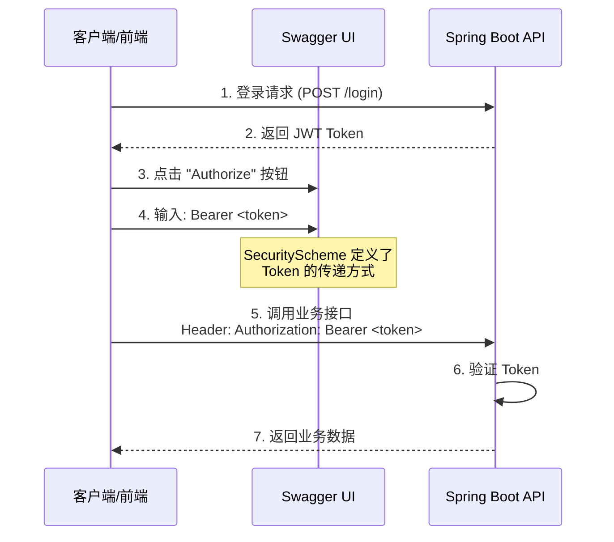

用户想了解 `SecurityScheme` 是什么。这是一个 OpenAPI/Swagger 规范中的概念。让我详细解释一下 `SecurityScheme` 的作用、类型以及在这段代码中的具体使用方式。
## `SecurityScheme` 详解

`SecurityScheme` 是 **OpenAPI 规范** 中的核心概念，用于定义 API 的**安全认证方式**。它是 `io.swagger.v3.oas.models.security.SecurityScheme` 类的实例。

---

### 📖 什么是 SecurityScheme？

```
┌─────────────────────────────────────────────────────────────┐
│                    OpenAPI 安全架构                          │
├─────────────────────────────────────────────────────────────┤
│                                                             │
│   SecurityScheme（安全方案）                                │
│   ├── 定义「如何认证」                                       │
│   ├── 类型：HTTP、API Key、OAuth2、OpenID Connect           │
│   └── 示例：通过 Header 传递 Token                          │
│                                                             │
│   SecurityRequirement（安全要求）                           │
│   ├── 定义「哪些接口需要认证」                               │
│   └── 引用 SecurityScheme                                    │
│                                                             │
└─────────────────────────────────────────────────────────────┘
```

---

### 🔐 代码中的 SecurityScheme

```85:93:yudao-framework/yudao-spring-boot-starter-web/src/main/java/cn/iocoder/yudao/framework/swagger/config/YudaoSwaggerAutoConfiguration.java
private Map<String, SecurityScheme> buildSecuritySchemes() {
    Map<String, SecurityScheme> securitySchemes = new HashMap<>();
    SecurityScheme securityScheme = new SecurityScheme()
            .type(SecurityScheme.Type.APIKEY)  // ① 认证类型
            .name(HttpHeaders.AUTHORIZATION)   // ② 参数名：Authorization
            .in(SecurityScheme.In.HEADER);     // ③ 位置：请求头
    securitySchemes.put(HttpHeaders.AUTHORIZATION, securityScheme);
    return securitySchemes;
}
```

**逐字段解析：**

| 方法 | 值 | 含义 |
|------|-----|------|
| `.type(APIKEY)` | `apiKey` | 使用 API Key 认证模式 |
| `.name(AUTHORIZATION)` | `Authorization` | 客户端需在请求头中携带名为 `Authorization` 的字段 |
| `.in(HEADER)` | `header` | API Key 位于 HTTP Header 中（非 query/cookie）|

---

### 🌐 实际效果展示

配置完成后，Swagger UI (Knife4j) 会显示：

```
┌─────────────────────────────────────────────────────────┐
│  🔒 Authorize 按钮（全局认证）                           │
├─────────────────────────────────────────────────────────┤
│  Available authorizations:                              │
│                                                         │
│  ┌─────────────────────────────────────────────────┐   │
│  │  Authorization (apiKey)                         │   │
│  │                                                 │   │
│  │  Name: Authorization                            │   │
│  │  In: header                                     │   │
│  │                                                 │   │
│  │  Value: [Bearer eyJhbGciOiJIUzI1Ni...    ]      │   │
│  │                                                 │   │
│  │  [Authorize] [Logout]                           │   │
│  └─────────────────────────────────────────────────┘   │
└─────────────────────────────────────────────────────────┘
```

---

### 🔧 OpenAPI 支持的 SecurityScheme 类型

```java
public enum Type {
    APIKEY,     // API 密钥（本代码使用）
    HTTP,       // HTTP Basic / Bearer Token
    OAUTH2,     // OAuth2 流程
    OPENIDCONNECT, // OpenID Connect
    MUTUALTLS   // mTLS 双向认证
}
```

**对比图示：**

```
┌──────────────┬────────────────────────────────────────────────┐
│ 类型         │ 典型使用场景                                     │
├──────────────┼────────────────────────────────────────────────┤
│ APIKEY       │ 简单的 Token 认证（如 Bearer Token）            │
│              │ Header: Authorization: Bearer <token>          │
├──────────────┼────────────────────────────────────────────────┤
│ HTTP         │ Basic Auth 或 Bearer 标准格式                   │
│              │ Header: Authorization: Basic base64(user:pass) │
├──────────────┼────────────────────────────────────────────────┤
│ OAUTH2       │ 第三方授权（如微信、GitHub 登录）               │
│              │ 支持 authorizationCode, implicit 等流程         │
├──────────────┼────────────────────────────────────────────────┤
│ OPENIDCONNECT│ 标准化身份认证（基于 OAuth2）                   │
└──────────────┴────────────────────────────────────────────────┘
```

---

### 🔄 完整的认证流程



---

### 💡 为什么使用 APIKEY 而不是 HTTP 类型？

```java
// 当前实现（APIKEY 类型）
.type(SecurityScheme.Type.APIKEY)
.name(HttpHeaders.AUTHORIZATION)
.in(SecurityScheme.In.HEADER)

// 等效的 HTTP Bearer 实现
.type(SecurityScheme.Type.HTTP)
.scheme("bearer")
.bearerFormat("JWT")
```

**使用 APIKEY 的原因：**

1. **更灵活** - 不强制要求 `Bearer` 前缀，兼容更多认证格式
2. **配置简单** - 只需指定 header 名称，无需额外 scheme 配置
3. **Knife4j 兼容性** - 与 Knife4j 可视化组件配合更好

---

### 📋 生成的 OpenAPI JSON 片段

配置后，访问 `/v3/api-docs` 会看到：

```json
{
  "components": {
    "securitySchemes": {
      "Authorization": {
        "type": "apiKey",
        "name": "Authorization",
        "in": "header"
      }
    }
  },
  "security": [
    {
      "Authorization": []
    }
  ]
}
```

这段 JSON 就是 `SecurityScheme` 和 `SecurityRequirement` 的标准表示形式，被 Swagger UI 解析后呈现为认证界面。

用户问的是 SecurityScheme 是否用于在 API 文档中显示认证信息。让我简洁明了地回答这个问题。

是的，SecurityScheme 的主要作用就是告诉 Swagger UI/Knife4j：
1. 这个 API 需要什么类型的认证
2. 认证信息应该放在哪里（Header、Query、Cookie）
3. 参数名叫什么

这样前端开发者在看文档时就知道如何调用接口了。
是的，**完全正确！**

`SecurityScheme` 的核心作用就是**在 API 文档（Swagger UI/Knife4j）中声明认证方式**，让前端/客户端开发者知道如何调用受保护的接口。

---

### 🎯 两个层面的作用

```
┌─────────────────────────────────────────────────────────────┐
│                    SecurityScheme 作用                       │
├─────────────────────────────────────────────────────────────┤
│                                                             │
│  1️⃣ 文档展示层（可视化）                                     │
│     └── Swagger UI 显示 "Authorize" 按钮和认证表单           │
│     └── 告诉开发者：「需要 Token，放在 Authorization 头里」   │
│                                                             │
│  2️⃣ 规范定义层（机器可读）                                   │
│     └── 生成 OpenAPI 规范的 securitySchemes 部分            │
│     └── 可被代码生成器、API 测试工具解析                      │
│                                                             │
└─────────────────────────────────────────────────────────────┘
```

---

### 📱 实际效果对比

#### ❌ 没有 SecurityScheme 时

```
┌─────────────────────────────────────────┐
│  Swagger UI - 用户管理接口               │
├─────────────────────────────────────────┤
│                                         │
│  GET /admin-api/system/user/get         │
│  获取用户详情                            │
│                                         │
│  [Try it out]                           │
│                                         │
│  ⚠️ 开发者疑惑：需要登录吗？Token放哪？    │
│                                         │
└─────────────────────────────────────────┘
```

#### ✅ 配置 SecurityScheme 后

```
┌─────────────────────────────────────────┐
│  Swagger UI - 用户管理接口               │
├─────────────────────────────────────────┤
│                                         │
│  🔒 GET /admin-api/system/user/get      │
│    获取用户详情                          │
│    (需要认证)                            │
│                                         │
│  [Try it out]                           │
│                                         │
│  请求头自动包含：                         │
│  Authorization: Bearer eyJhbG...        │
│                                         │
│  ✅ 开发者清楚：已登录，Token自动带上了     │
│                                         │
└─────────────────────────────────────────┘
```

---

### 🔑 关键点

| 作用 | 说明 |
|------|------|
| **显示 🔒 图标** | 标识哪些接口需要认证 |
| **提供认证入口** | 页面顶部的 "Authorize" 按钮 |
| **自动携带 Token** | 调试接口时自动在 Header 中加入 Token |
| **生成交互式表单** | 让开发者输入/修改认证信息 |

---

### 💡 一句话总结

> `SecurityScheme` = **API 文档里的「使用说明书」**，告诉调用者：**"请把你的 Token 放在 Authorization 请求头里发给我"**。

它本身**不负责真正的鉴权**（那是 Spring Security 过滤器的工作），只负责**告知和文档化**认证方式。