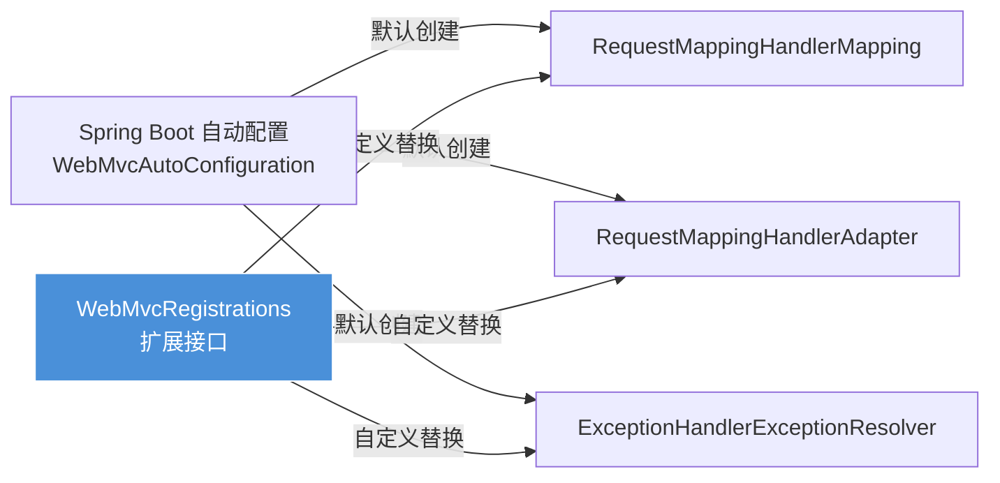

用户想了解 `WebMvcRegistrations` 是什么。让我先查看当前打开的文件 `YudaoWebAutoConfiguration.java`，看看它如何使用 `WebMvcRegistrations`。
好的，我现在可以看到 `WebMvcRegistrations` 在这个文件中的使用了。让我解释一下 `WebMvcRegistrations` 是什么以及它的作用。

`WebMvcRegistrations` 是 Spring Boot 提供的一个接口，允许开发者自定义和替换 Spring MVC 中的核心组件。

在这个代码中，它被用来：
1. 自定义 `RequestMappingHandlerMapping`
2. 设置 API 前缀路径

让我详细解释这个接口的作用和使用方式。
## `WebMvcRegistrations` 详解

`WebMvcRegistrations` 是 **Spring Boot 提供的扩展接口**，允许你**自定义和替换 Spring MVC 的核心组件**，而无需完全接管 Spring MVC 的配置。

---

### 🎯 核心作用



---

### 📋 接口定义

```java
public interface WebMvcRegistrations {
    // 自定义请求映射处理器（处理 @RequestMapping）
    default RequestMappingHandlerMapping getRequestMappingHandlerMapping() {
        return null;
    }
    
    // 自定义请求处理方法适配器
    default RequestMappingHandlerAdapter getRequestMappingHandlerAdapter() {
        return null;
    }
    
    // 自定义异常处理器
    default ExceptionHandlerExceptionResolver getExceptionHandlerExceptionResolver() {
        return null;
    }
}
```

---

### 🔍 代码中的实际应用

```49:85:yudao-framework/yudao-spring-boot-starter-web/src/main/java/cn/iocoder/yudao/framework/web/config/YudaoWebAutoConfiguration.java
@Bean
public WebMvcRegistrations webMvcRegistrations(WebProperties webProperties) {
    return new WebMvcRegistrations() {
        
        @Override
        public RequestMappingHandlerMapping getRequestMappingHandlerMapping() {
            RequestMappingHandlerMapping mapping = new RequestMappingHandlerMapping();
            // 关键：为不同包路径的 Controller 设置不同的 API 前缀
            mapping.setPathPrefixes(buildPathPrefixes(webProperties));
            return mapping;
        }
        
        // 构建前缀映射：/admin-api -> admin包, /app-api -> app包
        private Map<String, Predicate<Class<?>>> buildPathPrefixes(WebProperties webProperties) {
            Map<String, Predicate<Class<?>>> pathPrefixes = Maps.newLinkedHashMapWithExpectedSize(2);
            putPathPrefix(pathPrefixes, webProperties.getAdminApi());
            putPathPrefix(pathPrefixes, webProperties.getAppApi());
            return pathPrefixes;
        }
    };
}
```

---

### 💡 为什么要用它？

#### ❌ 不用 WebMvcRegistrations 的问题

```java
// 方式一：实现 WebMvcConfigurer
@Configuration
public class WebConfig implements WebMvcConfigurer {
    // 只能添加配置，无法替换核心组件
}

// 方式二：@EnableWebMvc
@Configuration
@EnableWebMvc  // 危险！会完全禁用 Spring Boot 的自动配置
public class WebConfig {
    // 需要自己配置全部 MVC 组件，容易遗漏
}
```

#### ✅ 使用 WebMvcRegistrations 的优势

| 特性 | 说明 |
|------|------|
| **精准替换** | 只替换需要的组件，其他保持默认 |
| **保持自动配置** | 不会禁用 Spring Boot 的 WebMvcAutoConfiguration |
| **无侵入性** | 其他配置仍然生效（如 Jackson、消息转换器等）|

---

### 🔄 工作流程图解

```
┌─────────────────────────────────────────────────────────────┐
│  Spring Boot 启动过程                                        │
├─────────────────────────────────────────────────────────────┤
│                                                             │
│  1. WebMvcAutoConfiguration 准备创建 MVC 组件                │
│                                                             │
│  2. 检查容器中是否存在 WebMvcRegistrations Bean              │
│     └── ✅ 发现 yudaoWebAutoConfiguration 创建的 Bean        │
│                                                             │
│  3. 调用 getRequestMappingHandlerMapping()                   │
│     └── 返回自定义的 mapping（带 /admin-api, /app-api 前缀） │
│                                                             │
│  4. 其他组件（adapter, resolver）使用默认实现                │
│                                                             │
│  5. 应用启动完成，所有 Controller 自动带上前缀               │
│     - AdminController → /admin-api/user/list                 │
│     - AppUserController → /app-api/user/info                 │
│                                                             │
└─────────────────────────────────────────────────────────────┘
```

---

### 🎨 实际效果对比

#### 配置前（默认）

```java
@RestController
@RequestMapping("/user")
public class UserController {
    @GetMapping("/list")
    public List<User> list() { ... }
}
// URL: /user/list
```

#### 配置后（使用 WebMvcRegistrations）

```yaml
yudao:
  web:
    admin-api:
      prefix: "/admin-api"
      controller: "**.controller.admin.**"
```

```java
// 位于 cn.iocoder.yudao.module.system.controller.admin 包下
@RestController
@RequestMapping("/user")
public class UserController {
    @GetMapping("/list")
    public List<User> list() { ... }
}
// URL: /admin-api/user/list  ← 自动加上了前缀！
```

---

### 📊 与其他配置方式的对比

| 方式 | 作用范围 | 风险 | 使用场景 |
|------|----------|------|----------|
| `WebMvcRegistrations` | 替换单个组件 | ⭐ 低风险 | 需要微调核心组件时 |
| `WebMvcConfigurer` | 添加配置 | ⭐ 低风险 | 常规扩展（拦截器、跨域等）|
| `@EnableWebMvc` | 完全接管 | 🔴 高风险 | 完全自定义 MVC（不推荐）|

---

### ✅ 一句话总结

> `WebMvcRegistrations` = **"精准手术刀"**，让你只替换 Spring MVC 的核心组件（如 `RequestMappingHandlerMapping`），而**不破坏** Spring Boot 的其他自动配置。在芋道项目中，它被用来**为不同模块的 Controller 自动添加 API 前缀**（如 `/admin-api`、`/app-api`）。